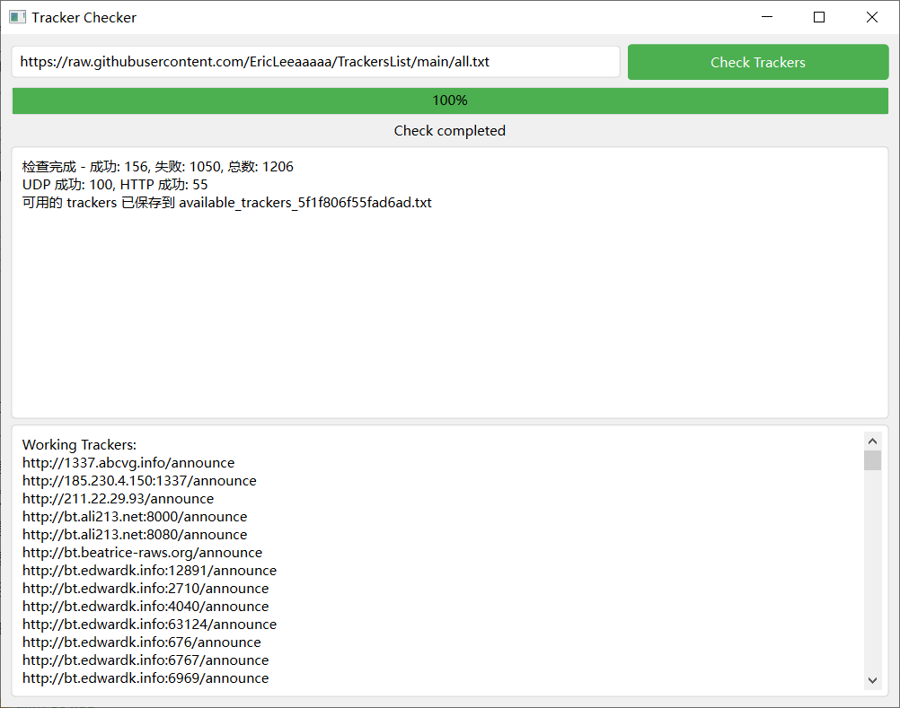

# UniTrackers

UniTrackers 是一个强大的 BitTorrent tracker 检查工具，具有现代化的图形用户界面。它能够快速高效地检测大量 tracker 的可用性，支持 UDP 和 HTTP/HTTPS 协议。



## 特性

- 支持 UDP 和 HTTP/HTTPS tracker 检查
- 现代化、美观的图形用户界面
- 高效的异步检查机制
- 实时进度显示
- 可自定义 tracker 列表 URL
- 自动保存可用 tracker 列表
- 详细的检查结果统计

## 使用方法

1. 安装依赖并运行主程序：
   ```
   pip install PyQt6 aiohttp tqdm
   python tracker++.py
   ```

2. 在打开的图形界面中，你可以看到一个默认的 tracker 列表 URL。你可以使用这个默认 URL，或者输入你自己的 tracker 列表 URL。

3. 点击 "Check Trackers" 按钮开始检查过程。

4. 进度条会显示检查的进度，状态标签会更新当前状态。

5. 检查完成后，摘要信息会显示在上方文本框中，可用的 tracker 列表会显示在下方文本框中。

6. 可用的 tracker 列表也会自动保存到一个文本文件中，文件名会在摘要信息中显示。

## 配置

目前，UniTrackers 不需要额外的配置文件。所有设置都可以通过图形界面完成。

## 贡献

我们欢迎并感谢任何形式的贡献！

## 许可证

本项目采用 Unlicense 许可证。详情请见 [LICENSE](LICENSE) 文件。

## 联系方式

如果你有任何问题或建议，请开启一个 issue 或直接联系项目维护者。

---

感谢使用 UniTrackers！我们希望这个工具能够帮助你更好地管理和优化你的 BitTorrent 体验。